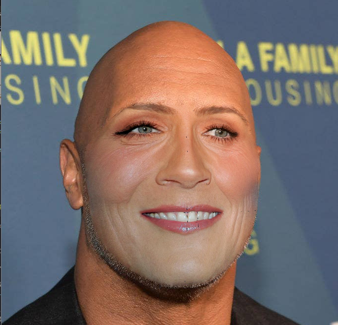
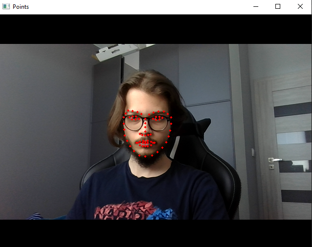
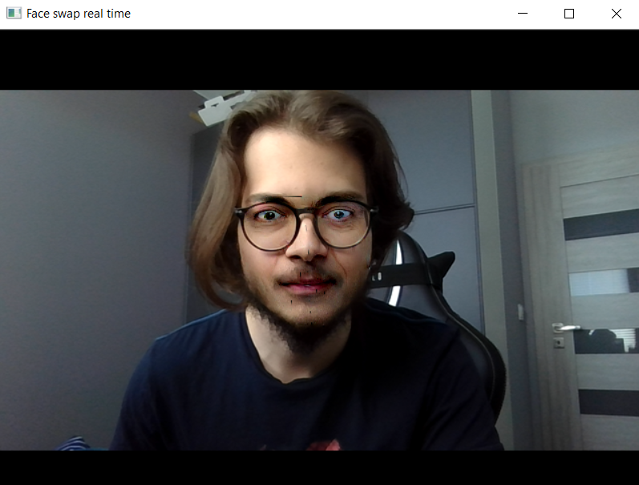
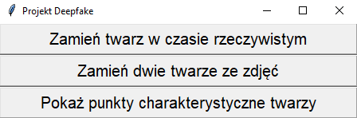

Program posiada trzy główne funkcjonalności:
- zamiana twarzy ze dwóch zdjęć

- wykrywanie punktów charakterystycznych twarzy w czasie rzeczywistym z kamerki

- zamiana twarzy ze zdjęcia z twarzą z kamerki w czasie rzeczywistym.

Do łatwiejszego korzystania z funkcjonalności stworozono proste GUI.

Użyte biblioteki:
- Numpy
- OpenCV
- dlib
- Tkinter

Aby program działał poprawnie należy mieć:
- wersja Python 3.5 lub niższa
- wyżej rozpisane biblioteki
- kamerka, jeśli chcemy skorzystać z funkcjonalności działających jedynie w czasie rzeczywistym
